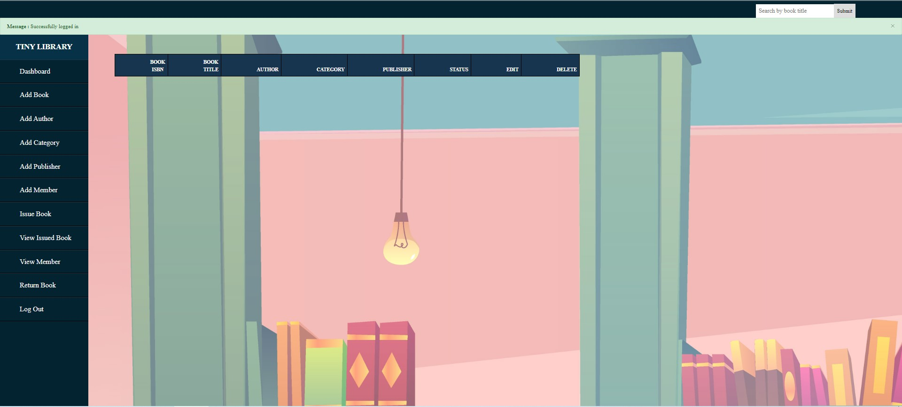

# TINY LIBRARY MANAGEMENT SYSTEM
#### Description: 

This is a library management system called Tiny Library or TinyLib in short. The project is written in Python as the main programming language, using MySQL as database system, I also use HTML and CSS to design the web page. The system is designed for library staffs to manage the library. System main functions include adding new authors, categories, publishers, member and books, searching for books by title or members by their name, issuing books for members, and finally returing borrowed books back to the library.

The project is written using Django framework. The project includes some automatically created files through Django and some self-made files. The "manage.py" file is the main file to run the system. The "templates" folder contains all the HTML files for the web. The "static" folder contains the main CSS file and inside static, there is the "img" folder containing all the images used for this project. The "TinyLib" folder is the project folder. The "home" folder is where I created the functions and database for this project.

#### Database design:

Below is my designed Entity Relationship diagram in order to build a database model for this project.

#### Testing:
Home page

 By clicking to the "STAFF" we can be directed to the Signup or Login page. 

Signup or Login page

Signup page

Login page

Dashboard

We will be directed to dashboard after logging in. We can see and edit books information here, we can also delete and search for books here. 

Add new author

Add new book type

Add new publisher

Add book

Before adding a new book, we have to make sure that the new book's author, type and publisher information are already inserted into the database.

Search book

We can search for a book by its title in the dashboard.

Add member

View member

Search member

Issue book

View issued books

Return books

#### Reference:

Part of the project code is consulted from the TechVidvanLibrary project. Refer to: https://techvidvan.com/tutorials/python-library-management-system/ 

